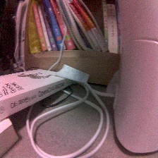
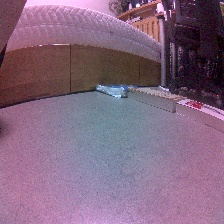
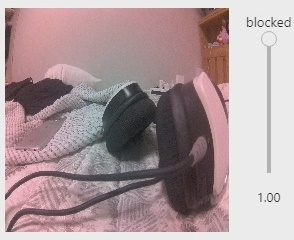

# collision_avoidance
장애물이 있는경우, 없는 경우를 CNN으로 학습시켜 로봇 스스로 판단하게 합니다.  
성능이 너무 느려 잘 되진 않았습니다.

|파일|내용|
|:---:|:---:|
|[data_collection.ipynb](https://github.com/sglee487/ComputerVisions/blob/master/jetbot/tutorial/collision_avoidance/data_collection.ipynb)|학습 데이터 수집|
|[train_model.ipynb](https://github.com/sglee487/ComputerVisions/blob/master/jetbot/tutorial/collision_avoidance/train_model.ipynb)|PyTorch를 사용한 모델 작성, 훈련|
|[train_model_tf.ipynb](https://github.com/sglee487/ComputerVisions/blob/master/jetbot/tutorial/collision_avoidance/train_model_tf.ipynb)|직접 작성한 tensorflow용 훈련이미지 변환, 작성, 훈련|
|[tensorflow_convert_lite.ipynb](https://github.com/sglee487/ComputerVisions/blob/master/jetbot/tutorial/collision_avoidance/tensorflow_convert_lite.ipynb)|tensorflow로 만든 모델 lite용으로 변환|
|[live_demo.ipynb](https://github.com/sglee487/ComputerVisions/blob/master/jetbot/tutorial/collision_avoidance/live_demo.ipynb)|PyTorch를 사용하여 장애물 감지, 이동|
|[live_demo_tf.ipynb](https://github.com/sglee487/ComputerVisions/blob/master/jetbot/tutorial/collision_avoidance/live_demo_tf.ipynb)|직접 작성한 tensorflow Lite를 사용하여 장애물 감지, 이동|

## data
|block(0)|free(1)|
|---|---|
|||

## live demo

모델을 작성하며 제일 어려웠던 점은 메모리 부족(OMM)과 약한 통신, 낮은 성능으로 인한 시간 지연이었습니다.  
이 점을 극복하고자 원래 작성된 PyTorch 대신 Tensorflow Lite로 구현하여 사용하였지만 아주 약간의 성능 향상이 있었을 뿐, 여전히 좋지 않았습니다. 더 작은 모델을 찾던지 학습 데이터 크기를 줄여야 할 것 같습니다.

-----------

