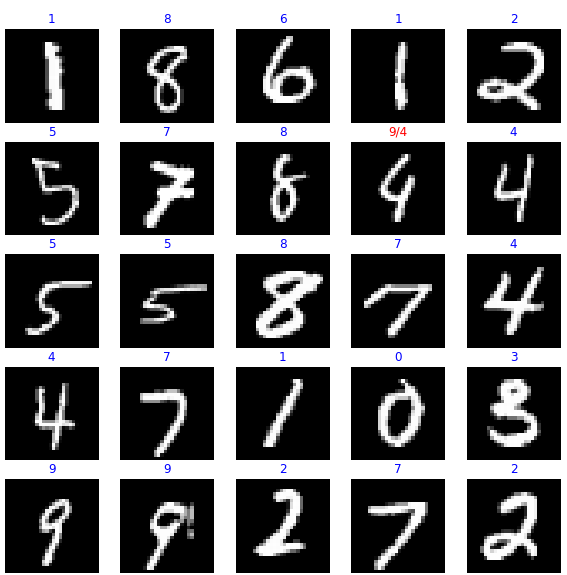

# Digit Recognizer
https://www.kaggle.com/c/digit-recognizer 
 keras에서 제공하는 ImageDataGenerator를 사용하여 CNN을 통한 이미지 분류 모델을 설계하는 프로젝트입니다.

|파일|내용|점수(high is better)
|:---:|:---:|:---:|
|[code_custom w datagen.ipynb](https://github.com/sglee487/ComputerVisions/blob/master/kaggle/digit-recognizer/code_custom%20w%20datagen.ipynb) [tf2-1-w-data-augmentation](https://www.kaggle.com/sglee487/tf2-1-w-data-augmentation)|data argumentation을 사용하여 훈련|0.99128|
|[code_custom wo datagen.ipynb](https://github.com/sglee487/ComputerVisions/blob/master/kaggle/digit-recognizer/code_custom%20wo%20datagen.ipynb) [tf2-1-w-o-data-augmentation](https://www.kaggle.com/sglee487/tf2-1-w-o-data-augmentation)|data argumentation을 사용하지 않고 훈련|0.98642|

 

 
예전에 실습했던 고양이 개 구분에서 확장하여 숫자를 구분해봤습니다. 여기서 배운건 예전에 일일이 data argumentation 함수를 정의했던 것과 달리 내장된 함수를 이용하여 더 간단하게 코딩했고, data argument를 한 것과 안한 것의 차이를 확인할 수 있었습니다. kaggle의 점수는 미미하지만 향상되었습니다.
