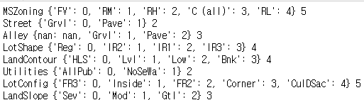

# House Prices: Advanced Regression Techniques
https://www.kaggle.com/c/house-prices-advanced-regression-techniques 
 이 프로젝트는 79개의 정보가 주어진 집의 매매가를 예측하는 모델을 설계합니다.

|파일|내용|점수(low is better)
|:---:|:---:|:---:|
|[neural-network-model-for-house-prices-keras.ipynb](https://github.com/sglee487/ComputerVisions/blob/master/kaggle/house-prices-advanced-regression-techniques/neural-network-model-for-house-prices-keras.ipynb) [Neural Network Model for House Prices (Keras)](https://www.kaggle.com/diegosiebra/neural-network-model-for-house-prices-keras)|기존에 있던 코드|0.13786|
|[house-prices-keras-w-object-mapping.ipynb](https://github.com/sglee487/ComputerVisions/blob/master/kaggle/house-prices-advanced-regression-techniques/house-prices-keras-w-object-mapping.ipynb) [house-prices-keras-w-object-mapping](https://www.kaggle.com/sglee487/house-prices-keras-w-object-mapping)|string mapping을 포함한 내가 작성한 코드|0.13686|

 

 
기존에 있는 코드에선 79개의 정보 중 42개가 string으로 되어있는데 숫자가 아닌 값은 학습 값으로 넣을 수 없기에 모두 버리고 학습하였습니다. 저는 이 정보들이 아까워서 활용하고 싶었으므로 string으로 되어있는 정보를 python의 dictionary로 만들어 모두 숫자값으로 mapping 하였습니다. 그 결과 미미하지만 보다 좋은 성능이 나오게 되었습니다. 
