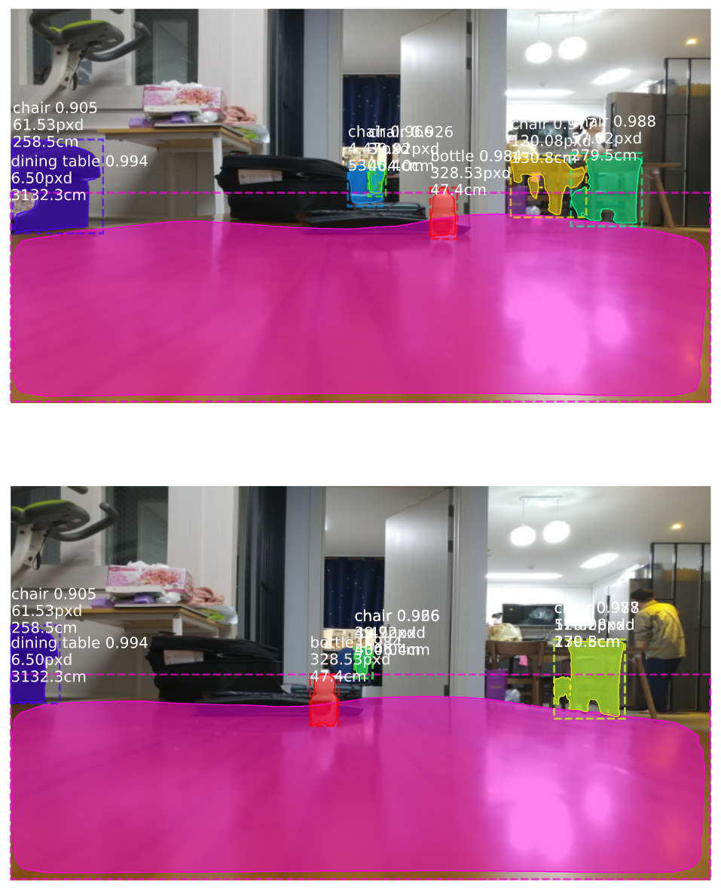

# 이 폴더는...
삼각거리를 이용하여 물체 거리를 추정해봤습니다.

|파일|내용|
|:---:|:---:|
|[demo-Copy1.ipynb](https://github.com/sglee487/ComputerVisions/blob/master/mask_rcnn/measure%20distance/demo-Copy1.ipynb)|삼각거리를 이용하여 물체 거리를 추정|

 
오른쪽 눈과 왼쪽 눈에 보이는 물체의 위치 차이가 거리에 반비례 하는 것을 이용해 만들어 본 코드입니다.

하나의 물체를 카메라 10cm 간격으로 띄워 각각 촬영했을 때 픽셀 차이와 실제 거리를 기반으로 그래프를 그려 식을 추정하여 만들었습니다. 여기에선 4656*3492 사진을 1920*1080 해상도로 변환하여 사용하고, 물체를 15cm ~ 100cm 거리 5cm 간격으로 측정하여 그래프를 만들었습니다. 이 때 추정한 관계식은 

**distance = (100000/((6.45*pixel_distance)-10))**

이었습니다.

그러나 15cm ~ 100cm 범위 외의 거리는 오차가 매우 크고 서로 다른 2가지 사진에서 같은 물체로 특정하기 힘든 단점으로 개선의 여지가 필요합니다.

-----------

#### 참고자료 / 사용된 모델  
https://github.com/matterport/Mask_RCNN
