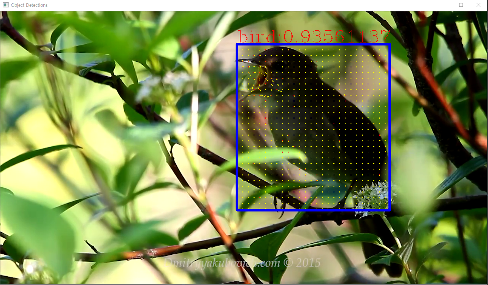

# 이 폴더는...
Mask R-CNN 모델 사용 연습을 하기 위해 만든 것입니다.

|파일|내용|
|:---:|:---:|
|[card detection.ipynb](https://github.com/sglee487/ComputerVisions/blob/master/mask_rcnn/object%20detections/card%20detection.ipynb)|카드 글자 인식 (잘 되진 않았음)|
|[object detection tf1.ipynb](https://github.com/sglee487/ComputerVisions/blob/master/mask_rcnn/object%20detections/object%20detection%20tf1.ipynb)| 피라미드 루카스 카나데 광학 흐름 검출   openCV 만을 이용한 객체 인식|
|[object detection tf1 maskrcnn_test.ipynb](https://github.com/sglee487/ComputerVisions/blob/master/mask_rcnn/object%20detections/object%20detection%20tf1%20maskrcnn_test.ipynb)|pretrained maskrcnn 사용 연습 |
|[object detection maskrcnn speed compare.ipynb](https://github.com/sglee487/ComputerVisions/blob/master/mask_rcnn/object%20detections/object%20detection%20maskrcnn%20speed%20compare.ipynb)|서로 다른 pretrained model 성능 차이 실험 |
|[object tracking.ipynb](https://github.com/sglee487/ComputerVisions/blob/master/mask_rcnn/object%20detections/object%20tracking.ipynb)|물체 움직임 추적|

-----------

#### 참고자료 / 사용된 모듈  
https://github.com/tensorflow/models/tree/master/research/object_detection

#### object detection 에서 사용된 모델  
(https://github.com/tensorflow/models/blob/master/research/object_detection/g3doc/detection_model_zoo.md)  
ssd_mobilenet_v1_coco_2018_01_28  
mask_rcnn_inception_v2_coco_2018_01_28  
